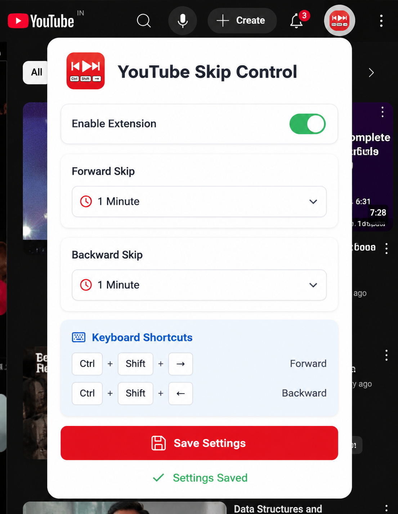

# YouTube Skip Control

A lightweight Chrome extension that lets you customize YouTube video skip intervals using keyboard shortcuts.

## Features

* Custom forward skip duration
* Custom backward skip duration
* Preset skip options

  * 5 Seconds
  * 10 Seconds
  * 30 Seconds
  * 1 Minute
  * 2 Minutes
  * 5 Minutes
* Custom duration support

  * Seconds
  * Minutes
* Enable / Disable extension
* Lightweight and fast
* Clean user interface

---

## Keyboard Shortcuts

| Action        | Shortcut         |
| ------------- | ---------------- |
| Forward Skip  | Ctrl + Shift + → |
| Backward Skip | Ctrl + Shift + ← |

---

## Installation

### Method 1: Load Unpacked Extension

1. Download or clone this repository.

```bash
git clone https://github.com/AbuZaid55/Youtube-skip-control.git
```

2. Open Chrome.

3. Navigate to:

```text
chrome://extensions
```

4. Enable **Developer Mode**.

5. Click **Load unpacked**.

6. Select the extension folder.

7. Open YouTube and enjoy.

---

## Usage

1. Click the extension icon.
2. Enable the extension.
3. Choose a preset skip duration or create a custom duration.
4. Save settings.
5. Use the keyboard shortcuts while watching YouTube videos.

---

## Project Structure

```text
youtube-skip-control/
│
├── manifest.json
├── content.js
├── popup.html
├── popup.css
├── popup.js
├── icon.png
└── README.md
```

---

## Permissions

### Storage

Used to save:

* Extension status
* Forward skip duration
* Backward skip duration

No personal information is collected.


## Privacy

This extension:

* Does not collect user data
* Does not track activity
* Does not send data to external servers
* Works entirely locally in your browser

---

## Contributing

Contributions, issues, and feature requests are welcome.

Feel free to fork the repository and submit a pull request.

